# :mortar_board: project-ml-microservice-kubernetes 
[](https://dl.circleci.com/status-badge/redirect/gh/fuongcao/project-ml-microservice-kubernetes/tree/main)
### :one: Complete the Dockerfile
- Completed [Dockerfile](Dockerfile)
- Pass lint checks
>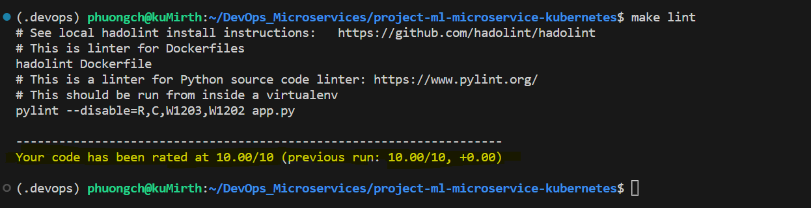

## :two: Run a Container & Make a Prediction
- Run container [./run_docker.sh](run_docker.sh)
>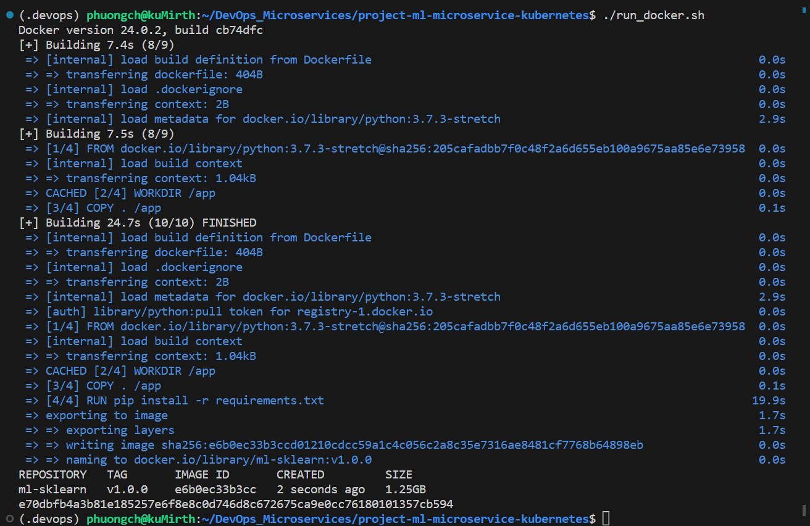

- Run Make a Prediction [./make_prediction.sh](make_prediction.sh)
>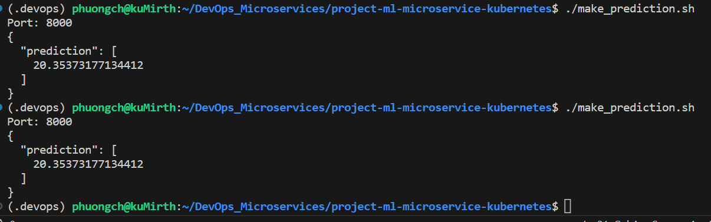

## :three: Improve Logging & Save Output
- Improve Logging. Add below code to app.py to log 'output prediction' as INFO
```
LOG.info(f"output prediction: {prediction}")
```
- Save Output. Find in [docker_out.txt](output_txt_files/docker_out.txt)

## :four: Upload the Docker Image :rocket: 
- To upload Docker image run [./upload_docker.sh](upload_docker.sh)
>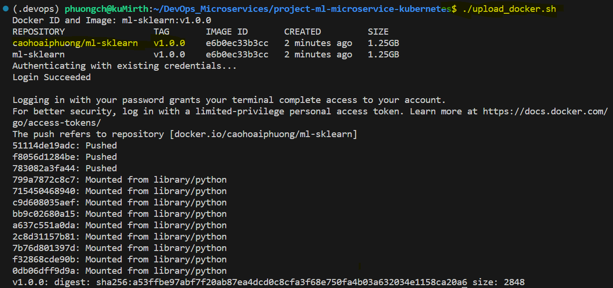
- Docker Repository
>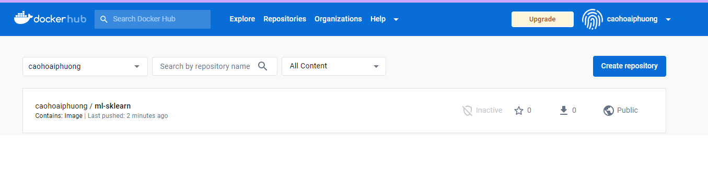


## :five: Configure Kubernetes to Run Locally
```
minikube start
```
>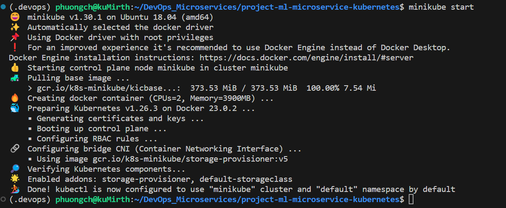

```
kubectl config view
```
>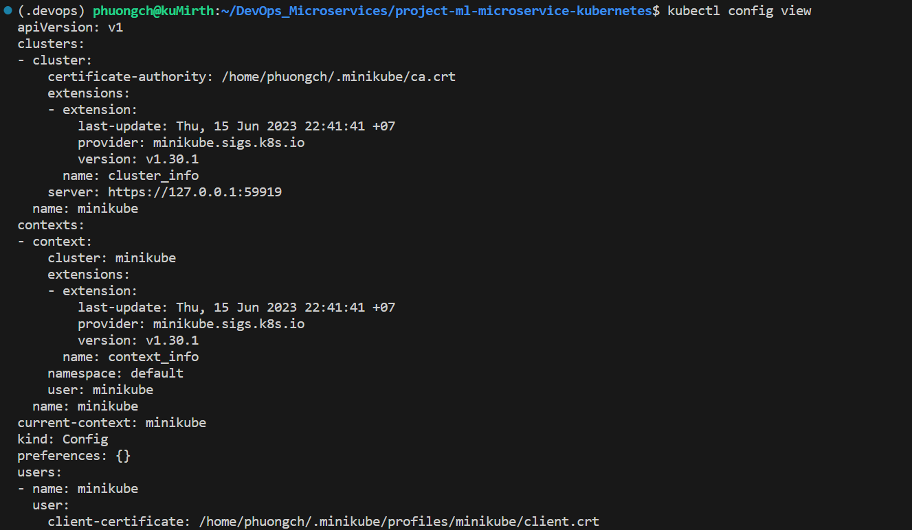

## :six: Deploy with Kubernetes and Save Output Logs
- Deploy with Kubernetes run [./run_kubernetes.sh](run_kubernetes.sh)
>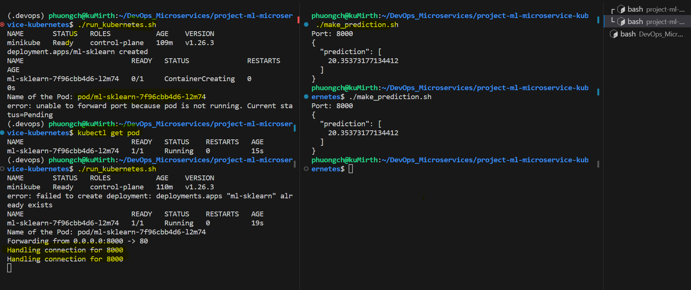
- kubernetes output file [kubernetes_out.txt](output_txt_files/kubernetes_out.txt)
>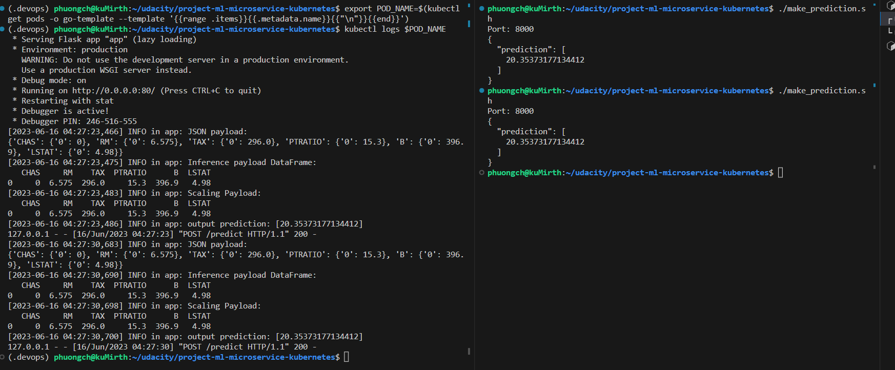

## :seven: [Important] Delete Cluster
```
minikube delete
```
>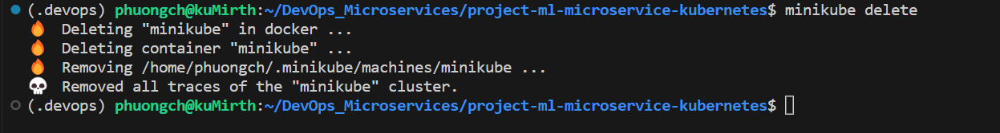


## :eight: CircleCI Integration
- CircleCi build pass:
>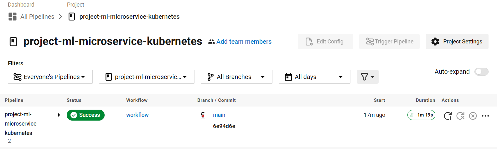

