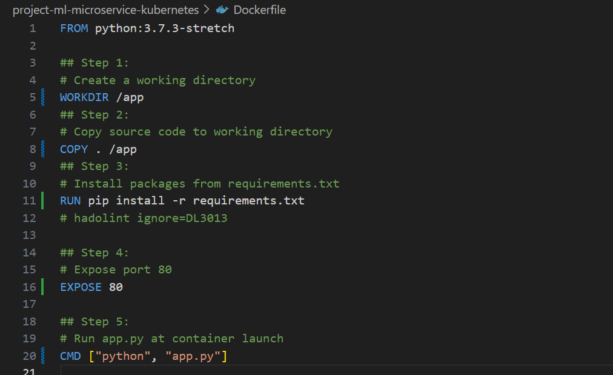

# project-ml-microservice-kubernetes
## Task 1: Complete the Dockerfile

### - Docker File
>

### - Pass lint checks
>

## Task 2: Run a Container & Make a Prediction
### - Run container
- [run_docker.sh](run_docker.sh)
>

### - Make a Prediction
- [upload_docker.sh](output_txt_files/docker_out.txt)
>

## Task 3: Improve Logging & Save Output
### - Improve Logging
 Add below to app.py
```
LOG.info(f"output prediction: {prediction}")
```
### - Save Output
- Find in [docker_out.txt](output_txt_files/docker_out.txt)

## Task 4: Upload the Docker Image
[upload_docker.sh](upload_docker.sh)

>

## Task 5: Configure Kubernetes to Run Locally
```
minikube start
```
>

```
kubectl config view
```
>

## Task 6: Deploy with Kubernetes and Save Output Logs
### Deploy with Kubernetes
[run_kubernetes.sh](run_kubernetes.sh)
>

## Task 7: [Important] Delete Cluster
```
minikube delete
```
>


## Task 8: CircleCI Integration
